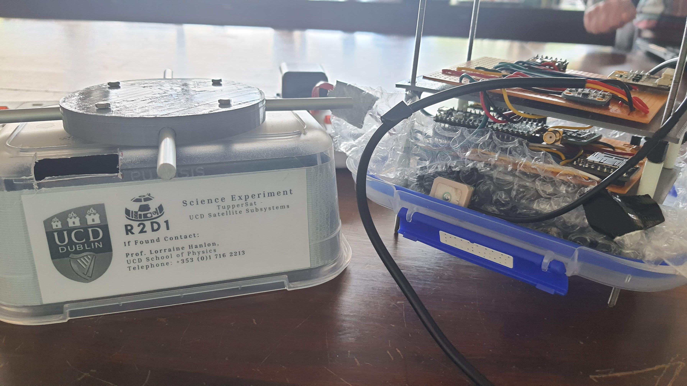
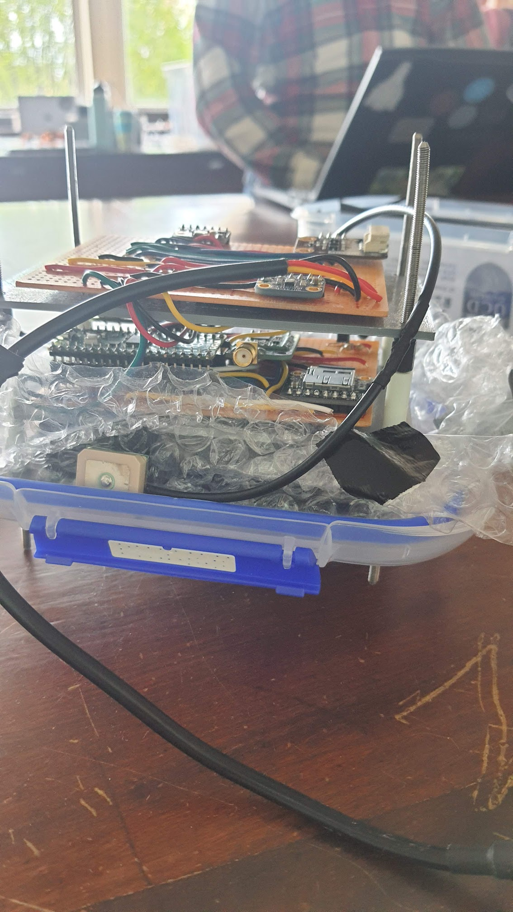
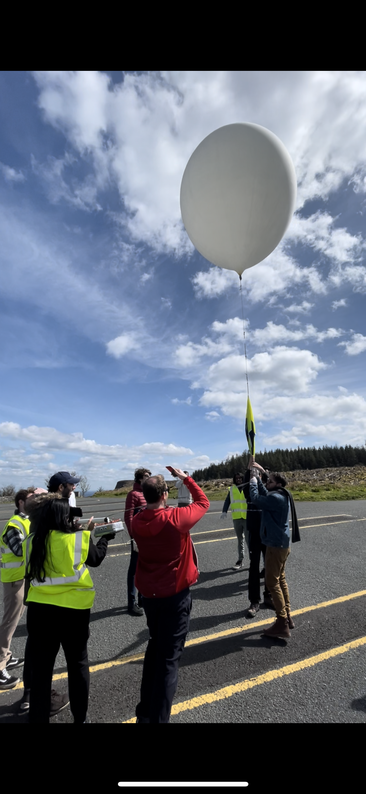
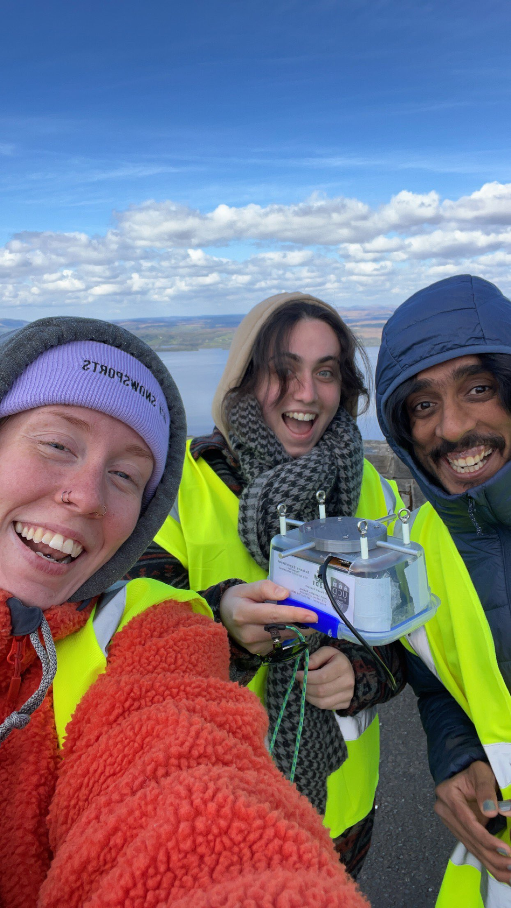

# Satellite Subsystems Laboratory - Team R2D1

> **Note**
> 
> This repo was orginallly hosted on UCD Satellite Subsystem's private repository, I cloned it and am hosting it here to showcase it. This is just the main branch. There were dev branched that I didn't clone.

This was launched on 25 April, 2023. 
Unfortunately our satellite was not recovered.

---

## Team Details

[Darya Corry - @dcorry2022](https://github.com/dcorry2022) : Structural and Verification Lead 

[Ramkiran Lepakshi - @iamlrk](https://github.com/iamlrk) : Systems Engineer and Software Lead

[Roisin Ryan - @RoRoisin](https://github.com/roroisin) : Electronics and Instrumentation Lead

---

## Repository Details

This is a repository that has the code for the tuppersat r2d1. 
It was designed and constructed to be launched on a weather balloon to study the attenuation of UV rays due to humidity.

[@dcorry2022](https://github.com/dcorry2022) role as a structural lead was to design and construct the structure for which the satellite electronics part goes in.
As a verification lead, verify the satellite from each component to it's assembled stage. 

[@iamlrk](https://github.com/iamlrk) role as a systems engineer was to draw out the techincal requiremetns and map out the Function and Product tree. 
As a Software Lead, design the software architecture, make the software interface requirements, and to development the actual software. 
Few parts of the software were authored by @dcorry2022. The author name is mentioned on top of each file.

[@RoRoisin](https://github.com/roroisin) role as an electronics and instrumentation lead was to design the circuit with the selected electronics components 
and assemble it.

---

## Components

### Repo Structure

All the main flight files are in `./tuppersat/` folder.

```bash
Tuppersat-R2D1:.
├───.idea
│   └───inspectionProfiles
├───exercises # place we did exerices given to us
└───flight - has all the functioning code
    ├───code
    │   ├───comms # has files used for commuication
    │   ├───gps # has the gps files
    │   └───sensors # has the code for temperature, pressure, uv and humidity sensors
    ├───data # recorded data is stored here
    └───tuppersat # this has the code required for ground comms - provided by UCD.
        ├───radio
        └───rhserial
```

### Electronics
1. Raspberry Pi Pico
2. Powerbank
3. SHT 31-D - Humidity Sensor
4. VEML 6075 - UV Sensor
5. DS18B20 - Temperature Sensor
6. MS5611-01BA03 - Pressure Sensor
7. SD Card
8. T3 Radio Transmittor
9. MIKROE-1032 - GPS Module 

---

## Images






